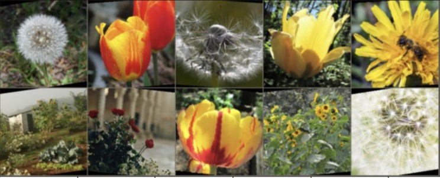

# Competition Overview

| Competitions                                    | Download                                                                           | Resources                                                       |
|-------------------------------------------------|------------------------------------------------------------------------------------|-----------------------------------------------------------------|
| [Facial Recognition](#facial-recognition)       | [fer2013.csv](https://myuni.adelaide.edu.au/courses/105236/files/17443097?wrap=1)  | [notebook](resources/Facial_Expression_Recognition_2025.ipynb)  |
| [Flower Classification](#flower-classification) | [flower.zip](https://myuni.adelaide.edu.au/courses/105236/files/17442946?wrap=1)   | [notebook](resources/Flower_Classification_2025.ipynb)          |
| [Animal Classification](#road-segmentation)     | [animal.zip](https://myuni.adelaide.edu.au/courses/105236/files/17443070?wrap=1)   | [notebook](resources/Animal_Classification_2025.ipynb)          |
| [Road Segmentation](#animal-classification)     | [seg_data.zip](https://myuni.adelaide.edu.au/courses/105236/files/17443098?wrap=1) | [notebook](resources/Segmentation_2025.ipynb)                   | 

### Downloads
The download links contain the datasets. 
You need to unzip these (except for the facial recondition dataset) and upload to your Google Drive, if Google Colab is used for assignments. 
You are welcome to use your local machine to work on the challenges as well. 
In this case, the datasets need to be appropriately placed to be used as well. 
> Ensure that you don't change the folder and file structure, as this will create problems in reproducing your results.
> Please note that these dataset files are NOT to be uploaded on MyUni with submissions.

### Notebooks
The notebook files have the baseline model training and testing implemented. 
Please use this as a reference boilerplate code.

> Please do not modify the accuracy measurement, train-test split creation, or the runtime computation code from the notebooks, 
as they are supposed to be frozen for this task. 

You are welcome to change architectures, training hyperparameters, loss functions and regularisation to improve the performance. 
Using pretraining from other datasets and adding data augmentation are welcome. 
A modified version of the notebook with your recommended changes should be uploaded with the submission for assessment. 

> Please note that you should only include your final model in the executed notebook to avoid confusion, 
and clearly report its efficiency and accuracy for grading.

### Baselines

For each challenge we provide baseline code that includes the following features:

1. Loading and analysing the dataset using torchvision.
2. Possibly providing some data augmentations (on data loading).
3. Defining a Convolutional Neural Network (baseline model).
4. Defining/choosing a loss function to facilitate the model learning.
5. Training the network using the training data.
6. Testing the trained network on the test data.
7. Making prediction for selected or random test image(s).

### Possible area of improvements

You could consider making the following improvements:

1. Change of training hyperparameters: learning rate, optimizer, batch-size, number of training epochs.
2. Use regularisation techniques such as dropout and batch normalisation.
3. Use a new/different loss function.
4. Apply additional/advanced data augmentation.
5. Making architectural changes: batch normalisation (yes, it is also a network layer), more layers, residual layers (skip-connections), or anything else you deem fit.
6. Leverage a pre-trained model or pre-training on a large dataset yourself, it is a form of *transfer learning*.

### Assessment

The mark distribution is listed below (out of 100 marks).

#### Accuracy [20 marks]: 

Based on student performance statistics in past offerings, we propose the following accuracy bands:

Performance bands:

| Lower bound (>=) | Upper bound (<) | Marks |
|------------------|-----------------|-------|
|                  | 25th percentile | 5     |
| 25th percentile  | 50th percentile | 10    |
| 50th percentile  | 75th percentile | 15    |
| 75th percentile  | 90th percentile | 18    |
| 90th percentile  |                 | 20    |

The percentile statistics of the datasets' accuracy values are below, we've floored down each of the percentile value:

| Datasets              | 25th | 50th | 75th | 90th |
|-----------------------|------|------|------|------|
| Facial Recognition    | 64%  | 66%  | 69%  | 70%  |
| Flower Classification | 77%  | 85%  | 92%  | 94%  |
| Animal Classification | 82%  | 91%  | 94%  | 96%  |
| Road Segmentation     | 34%  | 38%  | 42%  | 43%  |

#### Efficiency mark [20 marks]:
1. Efficiency concerns the computational cost of running the model (check the definition of [FLOPS](https://en.wikipedia.org/wiki/FLOPS)). 
2. The efficiency measurement we use here is defined to be the ratio of accuracy (in %) to GFLOPS:
$
 \text{Model Efficiency Score} = \frac{\text{Accuracy}}{\text{GFLOPS}}
$
3. Please report the computational cost for your final model and include the efficiency calculation in your report. 

The efficiency measurement bands take the similar form:

| Lower bound (>=) | Upper bound (<) | Marks |
|------------------|-----------------|-------|
|                  | 25th percentile | 5     |
| 25th percentile  | 50th percentile | 10    |
| 50th percentile  | 75th percentile | 15    |
| 75th percentile  | 90th percentile | 18    |
| 90th percentile  |                 | 20    |

The percentile statistics of the datasets' specific efficiency values are below, we've floored down each of the percentile value:

| Datasets              | 25th | 50th | 75th | 90th |
|-----------------------|------|------|------|------|
| Facial Recognition    | 197  | 321  | 715  | 1350 |
| Flower Classification | 193  | 1450 | 2266 | 3260 |
| Animal Classification | 186  | 687  | 1204 | 1530 |
| Road Segmentation     | 1    | 3    | 10   | 11   |

#### Report mark [60 marks]:
Your report should comprise:
1. An introduction showing your understanding of the task and of the baseline model: [20 marks]
2. A description of how you have modified aspects of the system to improve performance. [20 marks]
3. Explanation of the methods for reducing the computational cost and/or improve the trade-off between accuracy and cost: [10 marks] 
4. Limitations/Conclusions: [10 marks]

[Go back to Assignment Description](README.md)

# Dataset Information

## Facial Recognition

• 28,709 images, 7 classes

• Image size: 48x48

[Go back to the top of the page](#competition-overview)

## Flower Classification

• 4317 images, 5 classes

• Image size: approx. 320x240

[Go back to the top of the page](#competition-overview)

## Road Segmentation
• 150 training images, 19 classes

• Image size: 800x256

[Go back to the top of the page](#competition-overview)

## Animal Classification

• 151 Classes, 4702 images

• Image size: 224x224

[Go back to the top of the page](#competition-overview)

[Go back to Assignment Description](README.md)